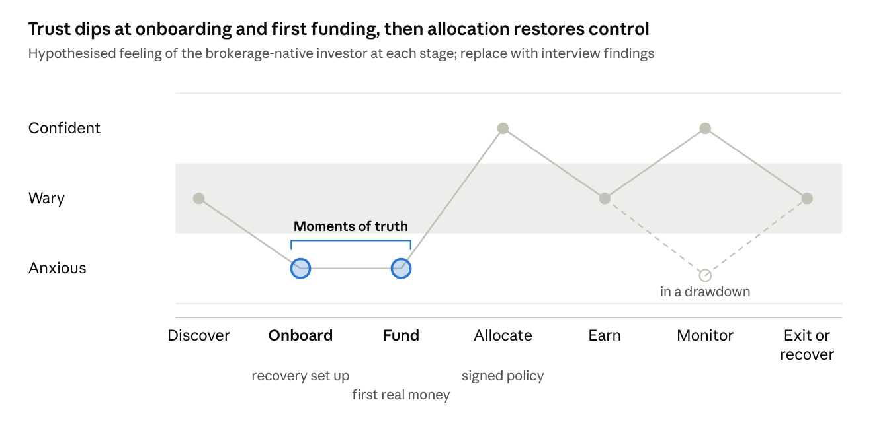

# Experience Map — Self-Custody Investment Account

As of October 5, 2026 · Author: AO · Live doc: https://claude.ai/code/artifact/198f11dc-76dc-4b4b-8ac0-17f756550f3d

## Summary

The brokerage-native investor's journey is won or lost in two places: onboarding, where recovery is set up, and first funding, where real money meets an irreversible system. Every later stage depends on the trust built there.

This map follows the primary user through the seven trust-critical stages named in the [Product Design Strategy](04-product-design-strategy.md#7-experience): Discover, Onboard, Fund, Allocate, Earn, Monitor, and Exit or recover. For each stage it sets out what the user is trying to do, what they are likely thinking, where today's products fail them, and what the design must do, tied to the five principles.

**How much to trust it.** It is a hypothesis map, built from desk research only. The stages, questions and constraints come from sourced research; the thoughts, feelings and emotional curve are inferred and must be replaced with what the generative interviews (research plan step 3) actually find. Each stage carries its evidence level.

## Who and what scenario

The map follows one user through one scenario; the stress cases test it at the edges.

**Primary user: the brokerage-native investor.** Self-directed, $25K or more investable, with no crypto or only ETF exposure. Thinks in allocations, drift and rebalancing, and is a novice at keys, chains and signing.

**Job to be done.** When I decide part of my wealth belongs onchain, help me put it there, keep it sized and earning, and know I can recover it, so I can stop thinking about it without giving anyone my keys or learning DeFi.

**Scenario (illustrative).** The investor has read that major asset managers suggest a 1% to 5% crypto slice. They decide on a small target, want part of it earning in dollars, and want to own it themselves rather than hold it on an exchange. They start with a small test deposit and grow it only if the product earns their trust.

**Stress cases.** Users aged 55 and over (28% of recent buyers, most exposed to fraud), self-custody regulars who want guardrails that do not slow them, a price fall of 30% or more, a compromised device, and the user's death. Covered in their own section below.

## The journey at a glance

Each stage turns on one question the user must see answered before moving on; the main trust risk is what happens if it goes unanswered.

| # | Stage | The user's question | What they want | Likely feeling (hypothesis) | Main trust risk | Principles |
| --- | --- | --- | --- | --- | --- | --- |
| 1 | Discover | "Is this legitimate, and is it for me?" | Confidence this is a real investor product, and when an ETF is better | Curious but wary | Looks like another crypto app, or overpromises | 4 |
| 2 | Onboard | "What if I lose access?" | Setup that feels like opening a brokerage account, with recovery they understand | Anxious about keys | Seed-phrase dread; skips or abandons recovery | 3, 4 |
| 3 | Fund | "What will this cost and where does my money go?" | Exact fees, arrival time, and proof the money landed | Most exposed; money in motion | Wrong address, hidden fees, unclear chain | 3 |
| 4 | Allocate | "How much should this be?" | A target tied to net worth and a signed policy | Deliberate, in control | Token list instead of a portfolio; unclear what the policy allows | 1, 5 |
| 5 | Earn | "Where does this return come from, and what could go wrong?" | A return they can explain to someone else | Tempted, sceptical | Picks the highest rate without knowing its source | 2 |
| 6 | Monitor | "Do I need to do anything?" | Silence when all is well, clear action when not | Calm, or alarmed in a drawdown | Panic exit in a fall; alert fatigue; no records at tax time | 5 |
| 7 | Exit or recover | "Can I get out, and can my family?" | A predictable unwind and a path for heirs | Relief, or grief for family | Illiquid exit; recovery that fails when needed; coerced withdrawal | 3 |

## Stage by stage

Each stage lists what the user does, where today's products fail them, what design must get right, and the signal that shows it worked.

### 1. Discover

- **Doing:** reads about crypto allocation, compares this product with a spot ETF or their brokerage's crypto sleeve, checks whether it is available in their state.
- **Thinking (hypothesis):** "Is this a scam? Why not just buy the ETF?"
- **Pain today:** self-custody wallets market trading and tokens; brokerages offer the allocation frame but hold the keys; eligibility gaps (New York and Texas exclusions at Robinhood and Coinbase) surface late.
- **Design must:** explain custody in one picture; compare honestly with an ETF, including when the ETF is better; state regulatory status and eligibility up front, with "not available to you, and why" as a real state.
- **Evidence:** Inference. **Signal:** share of visitors who start onboarding after the comparison.

### 2. Onboard

- **Doing:** creates the account, sets up passkey sign-in, chooses a recovery method, meets the custody map.
- **Thinking (hypothesis):** "If I lose my phone, is my money gone?"
- **Pain today:** seed phrases; only 43% of surveyed users could identify one (CHI 2025) and about 15% had tested recovery (vendor survey).
- **Design must:** passkey first; layered recovery options with plain trade-offs; a custody map showing who holds which key and what the product cannot do; a scam-awareness moment; recovery rehearsed before larger balances are allowed.
- **Evidence:** Hypothesis that a drill raises willingness to deposit. **Signal:** share who rehearse recovery; drop-off at the recovery step.

### 3. Fund

- **Doing:** links a bank or card, sends a small test deposit, then a larger one after the drill.
- **Thinking (hypothesis):** "Where exactly is my money right now?"
- **Pain today:** fees and chains are opaque; address poisoning and fraud are common (158,000 personal-wallet compromises in 2025).
- **Design must:** exact fees and arrival time before confirming; the chain named and explained, or abstracted with an audit trail; address-poisoning defence; the shared transaction states from Draft to Final.
- **Evidence:** Inference. **Signal:** share who fund beyond a small starter balance.

### 4. Allocate

- **Doing:** sets a target share of net worth, drift bands, limits and ask-first thresholds; signs the policy.
- **Thinking (hypothesis):** "What am I actually agreeing to let it do?"
- **Pain today:** wallets show a token list, not a portfolio; no product lets the user write rules the product then follows.
- **Design must:** tie the target to net worth; show risk contribution; write the policy in plain language, with every default disclosed and editable (non-discretion constraint); give a signed summary the user can revisit.
- **Evidence:** Hypothesis that users prefer writing their own rules. **Signal:** share who complete their own policy.

### 5. Earn

- **Doing:** chooses a dollar-earn sleeve, reads its risk, commits part of the allocation.
- **Thinking (hypothesis):** "Why is this rate so high, and what is the catch?"
- **Pain today:** bare APYs and teaser rates (MetaMask's 6% falling to 4% on October 1, 2026); curators unnamed; curated vaults have failed (Stream Finance, about $93M).
- **Design must:** a look-through risk card across contract, collateral, liquidity, issuer, depeg and regulatory risk; base, incentive and expiry shown separately; the curator named; an exit-time estimate; never calling held stablecoins "interest".
- **Evidence:** Hypothesis that showing the source changes choices. **Signal:** share who can name the source and main risk of their sleeve.

### 6. Monitor

- **Doing:** checks drift, approves or lets policy run rebalances, reads statements, prepares taxes.
- **Thinking (hypothesis):** "Do I need to do anything? Should I sell?"
- **Pain today:** no 1099-DA for self-custody; basis breaks on transfer; trading nudges in a drawdown.
- **Design must:** drift alerts only when action is needed; every automated action shows the rule that authorized it; incident banners that say what to do; statements and tax lots; a reminder of the target and rules they chose when prices fall, without telling them to hold or sell.
- **Evidence:** Inference. **Signal:** exits during a fall of 30% or more are deliberate, made after viewing their own target and rules; funds lost outside policy stays at zero.

### 7. Exit or recover

- **Doing:** withdraws part or all of the slice, recovers after losing a device, or a beneficiary claims the assets.
- **Thinking (hypothesis):** "Can I get my money out, and can my family if something happens to me?"
- **Pain today:** exit liquidity and timing are unclear; inheritance is an afterthought; users expect a reversal that self-custody cannot give.
- **Design must:** an unwind preview with liquidity timing; time-locked recovery; a beneficiary flow; a cooling-off delay on large exits and new payees to blunt coercion.
- **Evidence:** Inference. **Signal:** support contacts asking to "undo" a transaction stay rare; recovery succeeds when attempted.

## Emotional curve and moments of truth

Onboarding and first funding are the moments of truth: the user is asked to trust an irreversible system before seeing any benefit, so the recovery drill and exact fee and arrival information carry the most weight. The dashed branch is the drawdown path, where policy and allocation framing have to hold the user steady.

## Threads through every stage

Four elements appear at every stage and must look and behave the same wherever they do; each is a design system component to build once.

| Thread | What it shows | Where it first appears | Where it matters most |
| --- | --- | --- | --- |
| **Custody map** | Who holds which key, what the product, guardians and co-signers can and cannot do | Discover | Onboard, Exit or recover |
| **Policy citation** | The rule the user wrote that authorized an action, shown when the action runs | Allocate | Monitor |
| **Transaction states** | Draft, Simulated, Awaiting signature, Submitted, Pending, Confirmed, Final, plus Partially filled, Failed, Reverted and Delayed by policy; each with fees paid and what changed | Fund | Every money movement |
| **Records** | Tax lots, statements, imported brokerage slice | Fund | Monitor at tax time, Exit |

## Stress cases

The happy path hides the moments where self-custody hurts most; each stress case changes what one or more stages must do.

| Case | Stages it strains | What changes in the design |
| --- | --- | --- |
| **User aged 55 and over** | Discover, Onboard, Fund, Exit | Slower pacing and larger text; a trusted-contact option; stronger scam-awareness moments; cooling-off delays on new payees by default; a beneficiary flow set up early |
| **Self-custody regular** | Onboard, Allocate, Earn | Import an existing wallet; skip explanations they have seen; full detail (curator parameters, calldata) one tap away; guardrails that stay one tap inside policy |
| **Drawdown of 30% or more** | Monitor, Exit | Allocation and policy framing ahead of price; a reminder of the target they chose; no trading nudges; an exit that respects the cooling-off delay |
| **Compromised device or coercion** | Fund, Exit or recover | Time-locked recovery; delays on large exits and new payees; a clear statement that the product cannot reverse a signed transfer |
| **Death of the user** | Exit or recover | Beneficiary designation; a documented claim path for heirs who may know nothing about crypto; who can act, and after how long |
| **Earn incident** (depeg, vault loss) | Earn, Monitor | Incident banner naming the affected sleeve, what is known, and the action needed; exposure shown against the user's own limits |

## What to validate, open decisions and sources

The map should be rewritten from observed behaviour once the research plan runs; these are the checks that matter most.

- [ ] Replace inferred thoughts and feelings with quotes from generative interviews (research plan step 3).
- [ ] Confirm onboarding and first funding are the make-or-break moments, using drop-off in the recovery prototype (step 5).
- [ ] Test whether allocation framing at Allocate raises funding (step 6) and whether users can write their own policy (step 4).
- [ ] Test whether the Earn risk card changes which option people pick (step 7).
- [ ] Test what "account" leads people to expect at Discover and Exit (step 8).
- [ ] Walk Robinhood Wallet and MetaMask Money Account through all seven stages (step 1) and add their actual screens to the Pain today lines.

**Open decisions that change this map.** The discretion and execution model (how much Allocate and Monitor can automate, and who signs), the word "account" (Discover and Exit copy), first scope (which sleeves appear at Earn), the recovery partner (Onboard and Exit), and the primary user (who this map follows). All five are tracked in the [decision log](../decisions/decision-log.md).

**Sources.** [Problem Framing](03-problem-framing.md) for users, constraints, evidence and the research plan; [Product Design Strategy](04-product-design-strategy.md) for the principles, stages and success criteria; [Competitive Analysis](../research/02-competitive-analysis.md) for competitor behaviour. Figures are as cited there. Regulatory points are not legal advice.
