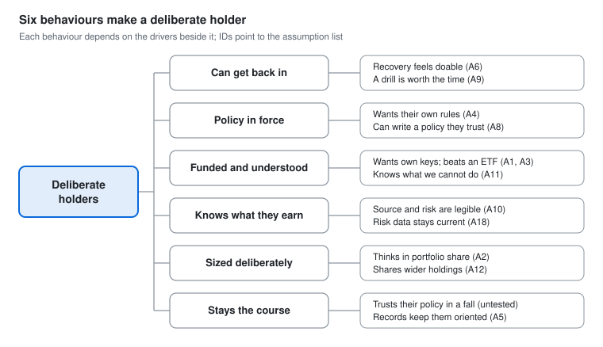

# Assumption Map — Self-Custody Investment Account

As of October 5, 2026 · Author: AO · Live doc: https://claude.ai/code/artifact/75a126a1-2ffd-448b-818c-2b46163ff772

## In brief

The strategy rests on 23 assumptions, and 13 of them are leaps of faith: a lot depends on them and there is little or no evidence. Three come before everything else, because if any one fails the positioning changes.

1. **A1. Brokerage-native investors want to hold their own keys at all.** No evidence exists for this group.
2. **A2. They think of crypto as a share of their portfolio.** The only support is advisor guidance, which is how professionals talk, not how individuals do.
3. **A4. They would write their own rules instead of wanting it managed.** No evidence, and the existence of robo-advisors suggests many investors prefer to delegate.

All three can be tested in one round of generative interviews, which is why that study comes first. Two further assumptions, that people can write a policy (A8) and that a recovery drill builds confidence (A9), decide the phase 1 scope and are tested next with prototypes.

Every assumption, rating and pass signal in this doc is my proposal, drawn from the [strategy v2](04-product-design-strategy.md) and the research behind it. The ratings are judgement and worth challenging; a different view of the business risks would reorder the list.

## Driver tree

The umbrella outcome, deliberate holders, is reached through six behaviours, and each behaviour happens only if the drivers beside it are true.

Read it left to right. The behaviours run top to bottom in journey order, so the upper ones are leading signals for the lower ones. Phase 1 focuses on funded and understood. Each driver is an assumption, listed by ID in the next section.

## The assumptions

There are 23, in five types: whether people want it, whether they can use it, whether it works as a business, whether it can be built, and whether it is allowed. "Depends" is how much of the strategy fails if the assumption is wrong. "Evidence" is what exists for the primary user, not for crypto holders in general.

| ID | Assumption | Type | Serves | Depends | Evidence |
| --- | --- | --- | --- | --- | --- |
| A1 | Brokerage-native investors want to hold their own keys at all | Want | The whole positioning | Critical | None for this group |
| A2 | They think of crypto as a share of their portfolio | Want | Bet 1; sized deliberately | Critical | Weak: advisor guidance only |
| A3 | Onchain earning is a reason to choose this over an ETF | Want | Funded and understood | High | None |
| A4 | They would write their own rules instead of wanting it managed | Want | Bet 3; policy in force | Critical | None |
| A5 | They miss brokerage-style records enough to value them here | Want | Bet 5 | Medium | Weak: inferred from tax rules |
| A6 | Fear of losing access is the main barrier to funding | Want | Bet 4; can get back in | High | Some: studies of existing holders |
| A7 | Exchange-only holders will move assets into their own custody | Want | Secondary user | Medium | Weak: most say they value it and do not act |
| A8 | People can write a policy they understand and trust | Use | Bet 3; policy in force | High | None |
| A9 | A recovery drill builds confidence more than it causes drop-off | Use | Bet 4; can get back in | High | None |
| A10 | Showing the source and risk of a return changes what people choose | Use | Bet 2; knows what they earn | High | None |
| A11 | False beliefs created by the word "account" can be corrected in the product | Use | Funded and understood | High | None |
| A12 | People will share their wider holdings so the slice can be shown as a share | Use | Bet 1; sized deliberately | Medium | None |
| A13 | They will pay for this | Business | Business model | Critical | Weak: Casa and Unchained prices, a different audience |
| A14 | The segment is large enough | Business | Business model | High | Weak: ownership surveys, no sizing |
| A15 | The product can reach them against Schwab and Robinhood | Business | Distribution | High | None |
| A16 | Revenue does not depend on pushing higher-risk vaults | Business | Business model; knows what they earn | Medium | None |
| A17 | A portfolio-level policy can be enforced reliably onchain | Build | Bet 3 | High | Some: the parts are in production; portfolio-level policy is new |
| A18 | Look-through risk data can be gathered and kept current | Build | Bet 2 | High | Weak: curators publish settings; the Stream failure shows the limits |
| A19 | A workable recovery partner model exists | Build | Bet 4 | Medium | Some: Casa and Unchained operate one |
| A20 | A user-written policy keeps the product non-discretionary | Allowed | Automation stance | Critical | Some: staff guidance, non-binding |
| A21 | Risk ratings can be presented as information, not advice | Allowed | Bet 2 | High | Weak |
| A22 | The enabling guidance stays in force | Allowed | Everything | Medium | Cannot be tested; monitor |
| A23 | No competitor ships an allocation-first self-custody account | Business | Where we play | High | Some: public pages, not hands-on |

## Priority

Thirteen of the 23 assumptions carry a lot of the strategy and have little or no evidence, so they are tested first.

Inside the top-left box the order is the test order: A1, A2 and A4 can sink the positioning and are testable now, A8 and A9 decide the phase 1 scope, and the rest follow. The four in the top-right box have some support but are too important to leave unconfirmed; each has a quick check (counsel, a teardown, the interviews, a technical proof). Items are placed by quadrant only, not by exact position.

## Tests

Each priority assumption has one cheapest test, a signal that counts as a pass, and a stated consequence if it fails. The pass signals are proposed thresholds to agree before each study runs, so the result cannot be argued either way afterwards. They are sized for the first interview round of 8 brokerage-native participants and for prototype rounds of about 10.

| ID | Assumption | Cheapest test | Pass signal (proposed) | If it fails |
| --- | --- | --- | --- | --- |
| A1 | Wants to hold their own keys | Generative interviews | At least 5 of 8 give their own reason to hold assets themselves, and at least 3 say they would move real money | Make the exchange-only holder the primary user, or stop leading with self-custody |
| A2 | Thinks in portfolio share | Interviews, with a walk-through of their brokerage app | At least 5 of 8 describe their crypto decision as a share or a limit of their total | Size the slice in dollars; rethink bet 1 |
| A4 | Prefers own rules | Interviews, then the rules prototype | Most already set some rule in their investing today, and in the prototype most choose to write or edit rules over accepting a default | Lead with a managed option through an adviser or named curator; the discretion model changes |
| A8 | Can write a policy | Rules prototype | 8 of 10 finish a policy unaided and correctly predict what it does in three scenarios | Move to editable templates the user picks and adjusts |
| A9 | Drill builds confidence | Recovery prototype, with and without the drill | The amount people say they would deposit is higher with the drill, and drop-off stays under a limit agreed in advance | Make the drill shorter, or required only above a balance threshold |
| A3 | Earning beats an ETF for them | Interviews; a choice task | Earning is named unprompted as a reason to choose this | Lead with ownership and control; earn becomes secondary |
| A10 | Seeing the source changes choice | Choice experiment | Fewer people pick the highest rate when the source is shown, and they can state its main risk | Redesign the risk card; consider fewer, clearer tiers |
| A11 | "Account" can be made honest | Wording survey with the custody map | After seeing the map, at least 8 in 10 answer correctly that the product cannot reverse or insure funds | Drop "account" for an alternative from the survey |
| A20, A21 | Policy is non-discretionary; ratings are information | Counsel review | A written view that both hold | Partner with a registered adviser; reframe ratings |
| A23 | No competitor ships this | Hands-on teardown of Robinhood Wallet and MetaMask Money Account | Neither shows targets, drift or user-written policy | Narrow the difference to recovery and risk depth |
| A6 | Fear of losing access is the main barrier | Generative interviews, asking about a time they held back from buying or moving crypto | Among those who held back, losing access is the reason named most often, unprompted | Keep the drill for safety, but lead funding with the barrier they do name; bet 4 stops being the funding lever |
| A18 | Risk data can be kept current | Build a risk card for three real vaults from public data | All fields filled from public sources, and refreshable | Reduce the card to what can be sourced; say what is unknown |
| A17 | Policy can be enforced onchain | Technical proof with one sleeve | A rule blocks an out-of-policy action in a test | Enforce in the app first and state that limit plainly |
| A14 | Segment is large enough | Desk sizing | A defensible estimate of US self-directed investors with $25K or more and little or no crypto | Widen the segment or revisit the business case |
| A13 | Will pay | Pricing study, once there is a prototype to price | Willingness to pay covers the model chosen | Change the model before building further |

A15, whether the product can reach these investors against Schwab and Robinhood, is a leap of faith with no design test. It belongs with PM and marketing and is listed so it is not forgotten.

## Research order

The work runs in three tracks: things that need no participants start now, interviews come first among the studies, and prototypes follow only if the interviews pass.

**Start now, in parallel (no participants).**

| Work | Assumptions | Suggested owner |
| --- | --- | --- |
| Hands-on teardown of Robinhood Wallet and MetaMask Money Account | A23 | Design |
| Counsel review of the discretion model, risk ratings and the word "account" | A20, A21 | Legal |
| Desk check: how investors use rules today (target allocations, auto-rebalancing, robo-advisor use) | Background for A4 | Research |
| Desk check: segment size | A14 | PM or research |
| Desk check: price benchmarks for safety and advice services | Background for A13 | PM |
| Risk card built for three real vaults | A18 | Design with engineering |

**Then, in order.**

1. **Generative interviews.** Tests A1, A2, A3, A6 and the first half of A4. If A1 fails, stop and revisit the positioning before any prototype.
2. **Rules prototype and recovery prototype.** Tests A4, A8 and A9. Passing these is the phase 1 gate in the strategy.
3. **Allocation home prototype.** Tests A2 in use and A12. Passing is the phase 2 gate.
4. **Choice experiment and wording survey.** Tests A10 and A11. These refine the risk card and the naming and do not change the direction.
5. **Pricing study.** Tests A13, once there is a prototype to put a price on.

**What this changes elsewhere.** The research plan in the [Problem Framing](03-problem-framing.md#research-plan) doc was reordered to match on October 5. Sections 4 and 9 of the [strategy v2](04-product-design-strategy.md) take their assumptions, tests and pass signals from this doc.

## Limits, open questions and sources

Four assumptions cannot be tested cheaply now, and the plan should say so instead of implying they are covered.

- **A22, the enabling guidance stays in force.** Nothing tests this. Monitor it, and keep earn features switchable.
- **Stays the course.** Whether holders keep their policy through a large fall can only be seen in a real drawdown. Interviews about past falls give a weak early read.
- **A15, reaching these investors.** No design test exists; it sits with PM and marketing.
- **A13, willingness to pay.** Stated willingness to pay is unreliable before there is something to try, so it waits.

**Open questions about this map.**

- [ ] Are the "depends" ratings right? They reflect a design view; PM and leadership may weigh the business assumptions higher.
- [ ] Are the pass signals acceptable as decision rules, especially 5 of 8 for the interviews?
- [ ] Is any assumption missing, particularly on the business and build sides, where this map is thinnest?
- [ ] Who owns each parallel task? The owners listed are suggestions.

**Sources.** The assumptions come from the [strategy v2](04-product-design-strategy.md), the [Problem Framing](03-problem-framing.md) and the [competitive analysis](../research/02-competitive-analysis.md). Evidence ratings draw on the project doc *Investment-Grade Self-Custody* (September 2026). The method, ranking assumptions by how much depends on them against how much evidence exists and testing the riskiest first, follows the outcome-led practice summarised in the [deep dive](../research/07-outcome-led-design-deep-dive.md).
